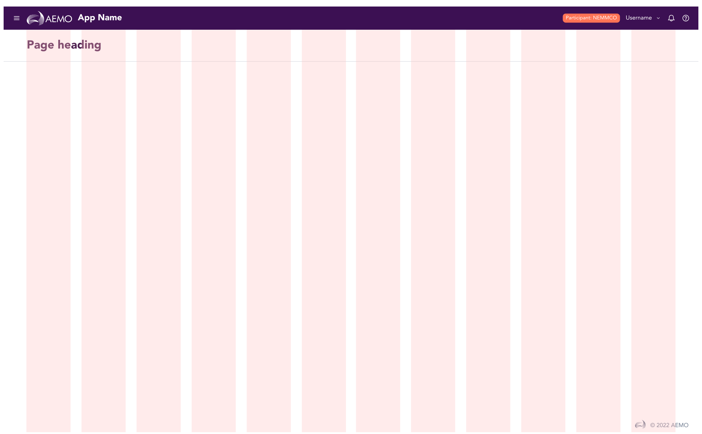
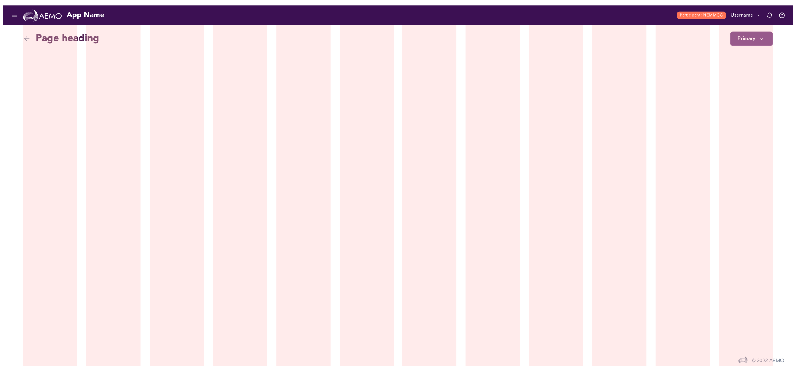
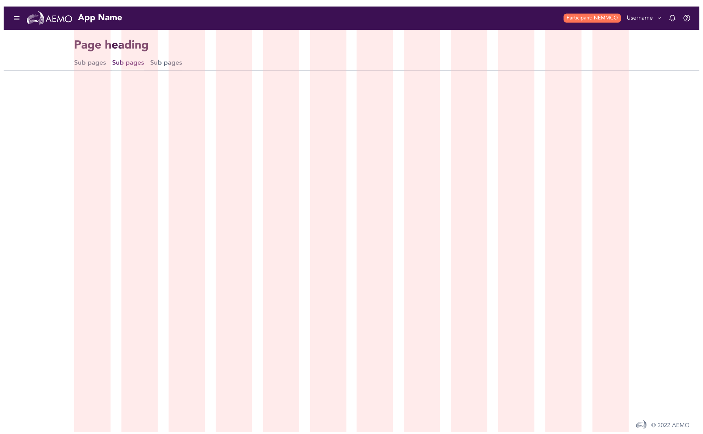
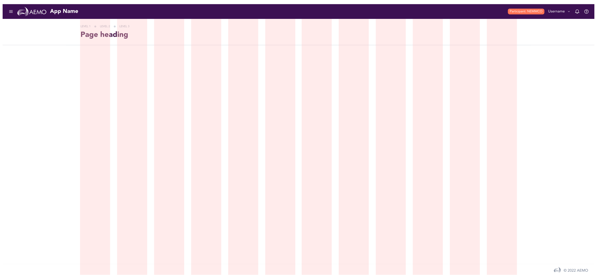
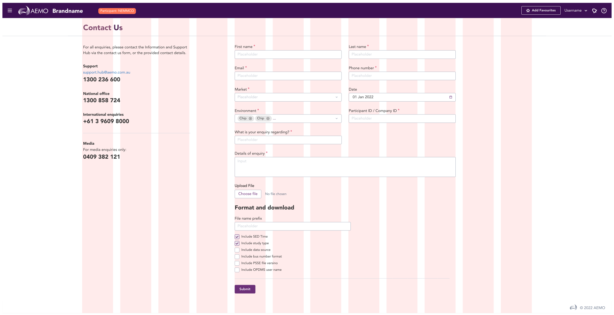
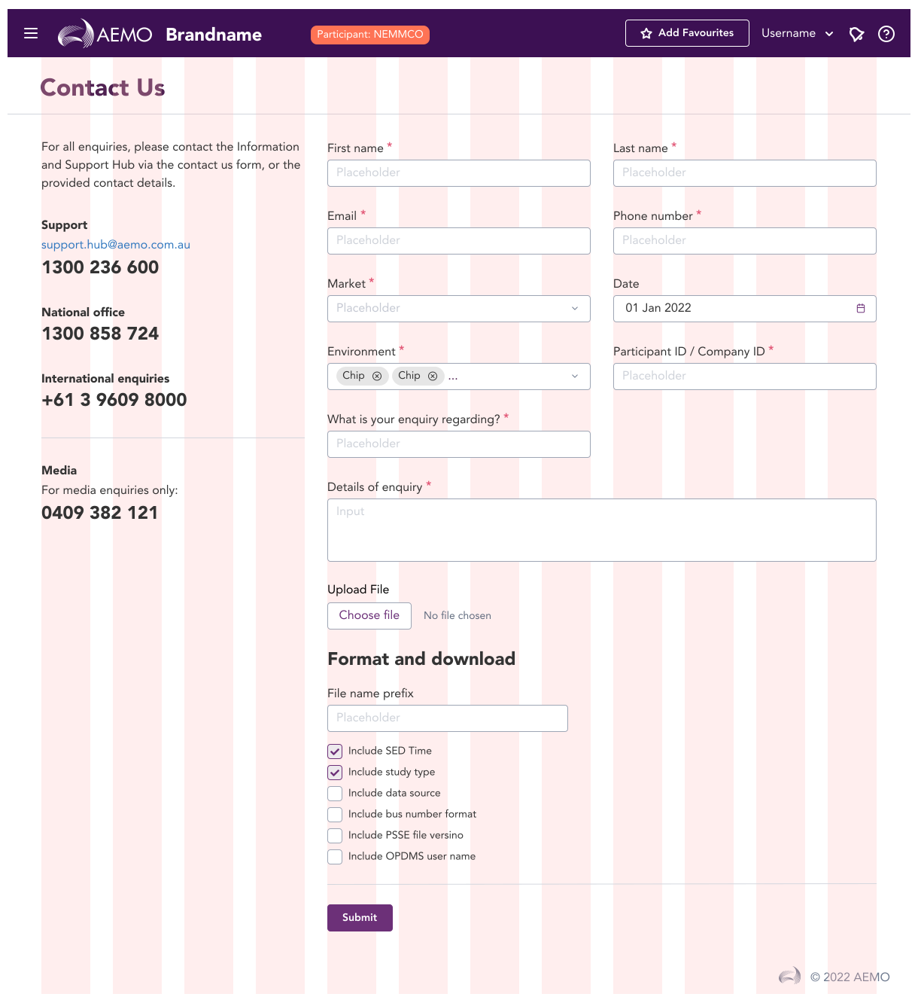

import AdmonitionExt from './admonitionExt'

> Page tempales are the skeletons to be used to produce any design within the breakpoints. Templates allows the designers to align contents within the [grid system](../guides/foundations/responsive.md) provided by GEL.

The templates are created based off of the grid system provided by Boostrap. While most breakpoints remain the same, the breakpoints in GEL for templates differ in higher resolution catering to larger screens.

|                               | XS        | SM        | MD        | LG        | XL        | XXL(Default)  | XXXL      |
| ---                           | ---       | ---       | ---       | ---       | ---       | ---           | ---       |
| Screen size                   | <576px    | >= 576    | >= 768    | >= 992    | >= 1200   | >= 1600       | >= 2560   |
| Fixed Container/Grid width    | 100%      |  540px    | 720px     | 960px     | 1140px    | 1560px        | 1920px    |
| Fluid Container/Grid width    | 100%      | 100%      | 100%      | 100%      | 100%      | 100%          | 100%      |

## Variants

There are two 2 different layouts(Fluid and Fixed) of templates with 7 variation of sizes for each catering all the screens that are possible. The following are 2 of the largest templates available. You can find all other variations in Figma.

Layout: Fluid | Size: XXL(Default)

Layout: Fluid | Size: XXXL

Layout: Fixed | Size: XXL(Default)

Layout: Fixed | Size: XXXL

In addition to the above, there are 10 other different sized layouts that can be chosen from GEL.

## Demo

## Guidance

* Use specific size layout for the screen that is being designed rather than resizing the template width. This looks okay specially in fluid layouts as the grid is set to resize with the template.
* Add elements at the start of any grid column to accurately design the end product.
* You can select the header and change the type of header on each of the template provided. You can choose between 6 different header styles(Default, Back, CTA, Subpages, Breadcrumb, Back + CTA)
* You can also change the type of footer to be used in the template. Ideally, the footer can be left as such as provided by the template.

## When to use

* Use template as the base of any UI design to place elements. This ensures that all the screens are visually similar out of the box.

## Designer assets

<AdmonitionExt type="figma" url="https://www.figma.com/file/kzLxtqv6YGL0wotiqzgEo4/GEL-UI-Doc?node-id=8%3A30268" />

## Developer API

:::caution Code

Templates are specific to GEL only and are not available in PrimeVue.

:::