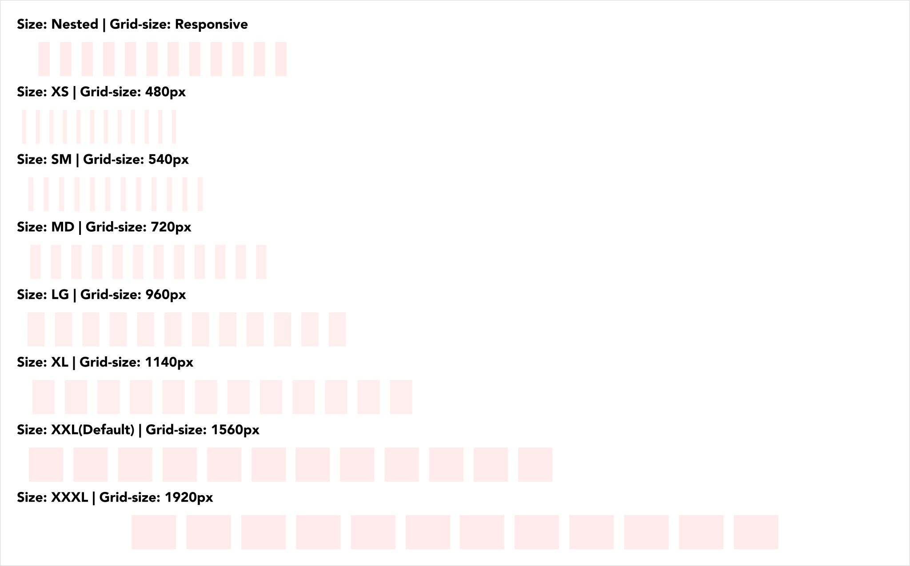

>9 out of 10 Australians own a mobile phone and the number of mobile users now matches the number of desktop users.

# What is Responsive Design?
Responsive design ensures the design and content of web-based tools and websites will scale to the size of the device that is being used. In most cases, functionality should match across all devices so that users are able to perform the same actions regardless of where and when they are attempting to.

Best practice is to start with a mobile-first approach, ensuring all relevant content and functionality is available on smaller devices with the design scaling up and responding to larger devices - as opposed to the opposite of designing for desktop first and attempting to ensure content and functionality works on mobile.

# The Grid
In order to design for a variety of screen sizes the use of a grid system is advised. A responsive layout grid adapts to screen size and orientation, ensuring a consistency across layouts.

The grid system in GEL is leveraged from Boostrap. While most breakpoints remain the same, the breakpoints in GEL for templates differ in higher resolution catering to larger screens.

|                               | XS        | SM        | MD        | LG        | XL        | XXL(Default)  | XXXL      |
| ---                           | ---       | ---       | ---       | ---       | ---       | ---           | ---       |
| Screen size                   | <576px    | >= 576    | >= 768    | >= 992    | >= 1200   | >= 1600       | >= 2560   |
| Fixed Container/Grid width    | 100%      |  540px    | 720px     | 960px     | 1140px    | 1560px        | 1920px    |
| Fluid Container/Grid width    | 100%      | 100%      | 100%      | 100%      | 100%      | 100%          | 100%      |

# The benefits of responsive design:

- Cost effectiveness in a creating and maintaining a single solution
- Improved and consistent usability and experience
- Flexibility