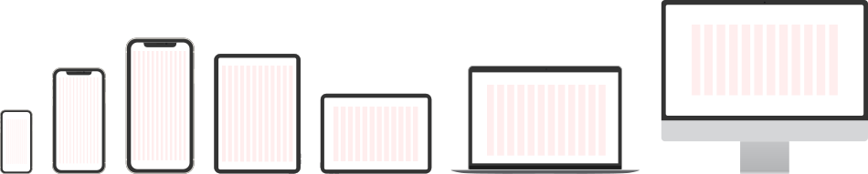
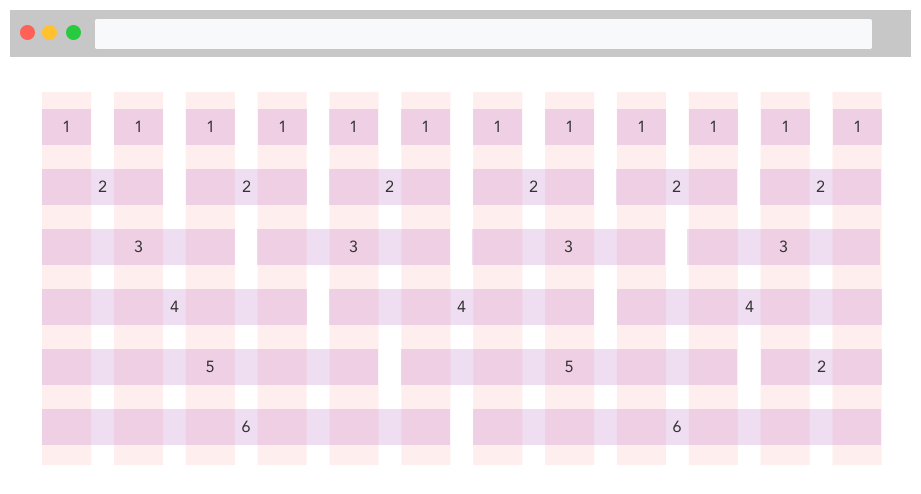
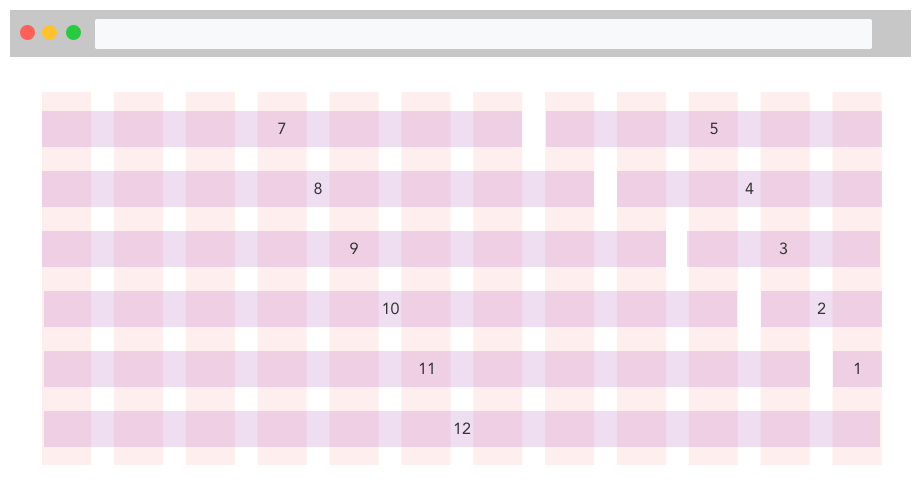
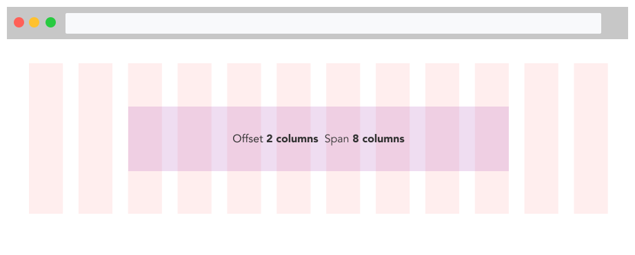
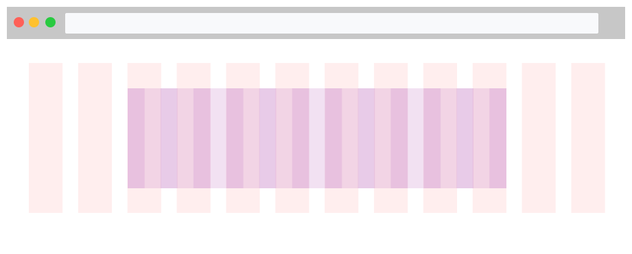
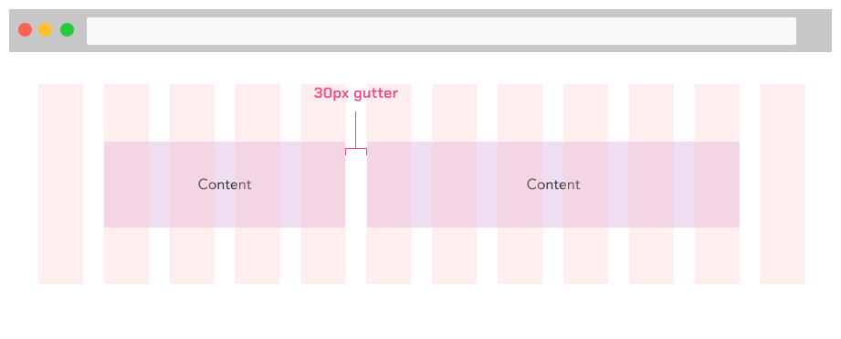

>9 out of 10 Australians own a mobile phone and the number of mobile users now matches the number of desktop users.

## What is a responsive design?
Responsive design ensures the design and content of web-based tools and websites will scale to the size of the device that is being used. In most cases, functionality should match across all devices so that users are able to perform the same actions regardless of where and when they are attempting to.

Best practice is to start with a mobile-first approach, ensuring all relevant content and functionality is available on smaller devices with the design scaling up and responding to larger devices - as opposed to the opposite of designing for desktop first and attempting to ensure content and functionality works on mobile.

## The grid
In order to design for a variety of screen sizes the use of a grid system is advised. A responsive layout grid adapts to screen size and orientation, ensuring a consistency across layouts.

The grid system in GEL is leveraged from Boostrap. While most breakpoints remain the same, the breakpoints in GEL for grids differ in higher resolution catering to larger screens. These grids are primary building blocks to [templates](../components/templates.md) available in GEL.

|                               | XS        | SM        | MD        | LG        | XL        | XXL(Default)  | XXXL      |
| ---                           | ---       | ---       | ---       | ---       | ---       | ---           | ---       |
| Screen size                   | <576px    | >= 576    | >= 768    | >= 992    | >= 1200   | >= 1600       | >= 2560   |
| Fixed Container/Grid width    | 100%      |  540px    | 720px     | 960px     | 1140px    | 1560px        | 1920px    |
| Fluid Container/Grid width    | 100%      | 100%      | 100%      | 100%      | 100%      | 100%          | 100%      |

## Page containers

Users can choose between two kinds of layout width which set the behavior of page containers: fluid (default) or fixed.

The **fluid** layout does not impose any width restrictions to page containers, so elements expand across the screen to fill all available space.

The **fixed** layout applies the ideal maximum width to page containers according to the elements being displayed so they can be experienced using the most appropriate width.

The grids are actively being used in the [template](../components/templates.md) component in Figma.

## Columns

The grid consists of 12 columns differing in screen sizes. A gutter is applied in between each column to show the separation of the grid columns. At each breakpoint, we have the opportunity to adjust how the content can be displayed in the grid.

The image below shows how the contents or divs can be divided into different parts of the grid. Since, we are using a 12 grid layout and the number is divisible by 1, 2, 3, 4 and 6, a plethora of options are now available to create designs that are responsive and adjust the content accordingly.

The layout is not limited to only divisions of 12. As long as the sum of columns used is less than or equal to 12, the user can create any kind of design. Similar to the bottom image.

### Column offset

The layout is not limited to only divisions of 12. As long as the sum of columns used is less than or equal to 12, the user can create any kind of design. Similar to the bottom image.

## Nested grid

Nested grid is a grid that is put into containers that already has a grid in it. The key takeaway here should be that nested grids will also have 12 columns when used and have the same margin or gutter width between the columns no matter how small the container.

Nested grid is the basis of fluid layout in GEL i.e. Nested grid is the parent grid in a fluid layout.

## Column gutters

Gutters are the gap the are placed in between column in a grid. Gutters provide breathing space to the content ensuring the contents are withing a certain gap with each other. By default, all the columns in the grid has a gutter of 15px on the left and right meaning a 30px gutter in between each column of the grid.

# The benefits of responsive design:

- Cost effectiveness in a creating and maintaining a single solution
- Improved and consistent usability and experience
- Flexibility