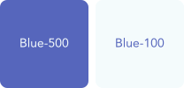

> The relationship between the brand color, neutral color(shades of grey), accessible color and visualization color create a scalable foundation for AEMO’s color palette in the design system.

## Purple - Shades of primary color

Purple is the brand color of AEMO. You can see the logo of AEMO using the brand color apart from some situational white for lighter usage. In the design token, the purple color is also termed as primary color with 7 different shades.

The purple color is strictly reserved for logo and call to action items including buttons and links. This ensures that the designs are not cluttered with overuse of purple and focus is given to the most important item that pops out easily.

## Grey - Shades of slate

GEL uses 9 shades of grey in the color system. These shades of grey are also termed as slate color or tertiary color. Each shade of the slate color can be used for different scenarios ensuring any new concept or design element can fit with the existing components in harmony.

We have ensured that all these shades pass the WCAG 2.0 level of 4.5:1 contrast ratio for normal text and 3.1 for large text.

## Accessible color

Accessible color can be used in a variety of ways to communicate meaning. They are also termed as secondary color in GEL’s color palette. GEL accessible color meaning include informative, accent, danger, warning and success. These color are used in conjunction with text or icon to ensure that the meaning is not lost for users who are unable to see or differentiate color.

Assigning generic meaning to a subset of color sets consistent expectations for the users. These meanings are embedded into the components and codified in design tokens.

Similar to shades of slate color, we have ensured that these accessible color has the contrast ratio of 4.5:1 for normal text and 3.1 for large text to meet the standard of WCAG 2.0.

| Color | Meaning |
| ----- | ------- |
|  | Blue indicates a current or active state. It communicates management, progress, connectivity, or organization. |
|  | Green indicates success. It communicates save, create, add, available, done, approved, or resolved. |
|  | Orange indicates attention is required. It communicates warning, pending, missing, or impeded progress. |
|  | Red indicates a problem. It communicates a critical state, destructive action, error, failure, removal, stop, or decline. |

## Data visualization color

Data visualization color are color that can be used for infographics such as charts and graphs. AEMO has taken precise steps to come up with different color semantics for various elements in the AEMO energy market.

These color are part of the secondary palette and can be used within in components other than infographics.

The following colors, also termed as fuel color in GEL and are restricted to data visualization and infographics.

## Resource

[Color contrast checker (WebAIM)](https://webaim.org/resources/contrastchecker/)