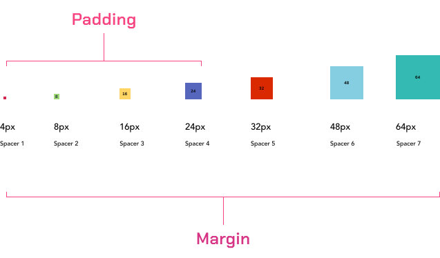
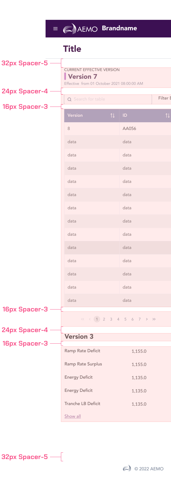
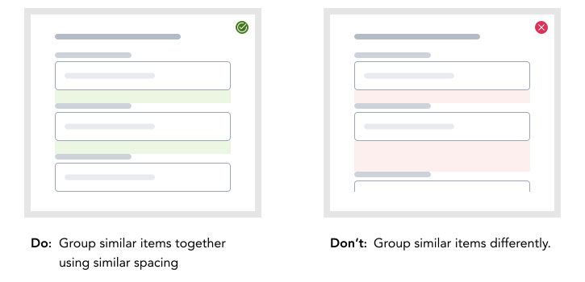
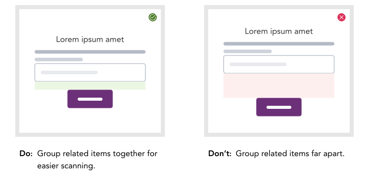
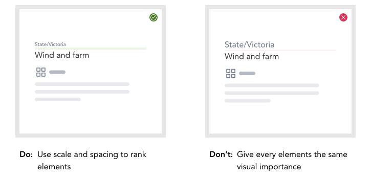

import * as Token from '@danielwang/aemo-design-tokens/dist'
import ShowVar from '../design-tokens/_showVar'

export const Space = ({spacer}) => ( 

 );

> All AEMO components follow a 4 px spacing system. 4 pixels is small enough to allow for fine-grained control over spacing, yet it’s still large enough that the spacing is clearly visible and easy to work with. By following a set spatial convention, we decrease design complexity while increasing consistency across the application.

## Geometric progression

Building on the 4px base unit, the main foundation of your spacing system is the spacing scale. This scale is a limited set of spacing values that is used to lay out UI elements in a consistent way.

Each spacing value is a multiple of the base unit and ranges from 0px to 64px allowing flexibility whilst still maintaining consistency.

| Demo | Value | SCSS Variables | Visual |
|---|---|---| --- |
| 0x    | <ShowVar code={Token.Spacer0} /> | 0px | <Space spacer={Token.Spacer0} /> 
| 1/4x  | <ShowVar code={Token.Spacer1} /> | 4px | <Space spacer={Token.Spacer1} /> 
| 1/2x  | <ShowVar code={Token.Spacer2} /> | 8px | <Space spacer={Token.Spacer2} /> 
| 1x    | <ShowVar code={Token.Spacer3} /> | 16px| <Space spacer={Token.Spacer3} /> 
| 1.5x  | <ShowVar code={Token.Spacer4} /> | 24px| <Space spacer={Token.Spacer4} /> 
| 2x    | <ShowVar code={Token.Spacer5} /> | 32px| <Space spacer={Token.Spacer5} /> 
| 3x    | <ShowVar code={Token.Spacer6} /> | 48px| <Space spacer={Token.Spacer6} /> 
| 4x    | <ShowVar code={Token.Spacer7} /> | 64px| <Space spacer={Token.Spacer7} /> 

## Standard spacing guidelines

The templates come with the navbar, header and footer by default for any UI design. The following guidelines can help create a consistent UI across AEMO’s applications.

###  Spacer-2

The spacer-2 calculated as **8px** or **0.5rem** is for atomic level elements or siblings. These are the basic block that creates a component. Example would be spacing between checkboxes/radios.

### Spacer-3

The Spacer-3 calculated as **16px** or **1rem** is for component level contents between atoms and molecules in a related group. Example would be spacing between a content level header and its table or table and pagination.

### Spacer-4

The Spacer-4 calculated as **24px** or **1.5rem** is for organism level contents. This spacing is used between two blocks of data that provide different value to a UI ideally grouped under separate heading to provide context to each block.

### Spacer-5

The Spacer-5 calculated as **32px** or **2rem** is for landmarks. Since the template comes with these landmarks, the 2rem spacing can be used to separate the content from these landmarks.

### Demo

## Spacing principles

A layout is constructed using UI elements and  components as well as the space between them. The relationships between elements can be easily understood by customers which make it simpler for them to scan and comprehend the content on the page by utilizing the following spacing principles.

### Group by similarity

Users expects elements to be grouped semantically ,our grouped in such a way that it provides greater context around the information provided.

### Group by proximity

The distance between elements creates semantic meaning. Elements that are placed close to one another are assumed to be related than those which are not. For example placing elements of an empty state illustration gives the indication that the elements included are related. 

### Order and hierarchy

While scanning through the UI, user tend to look for order in the visual information provided. Difference in size and space reduces the mental effort required by the use to scan the layout. The sizing of different elements lends more importance to larger elements by drawing focus in comparison to smaller-sized elements. Similarly, varying the amount of whitespace around an element can be used to group elements together or separate them to impart greater importance.

## See also

- [Spacing tokens](../design-tokens/space.md)

