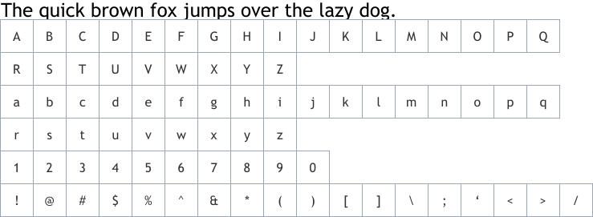

import Video from '../../components/video'

>Typography is an essential part of the AEMO visual system. When used consistently, it unifies messaging and creates familiarity.

## Primary font

Avenir is the primary font. AEMO communications should use Avenir, including all body copy and headings.

The word Avenir means “future” in French and hints that the typeface owes some of its interpretation to Futura. But unlike Futura , Avenir is not purely geometric; it has vertical strokes that are thicker than the horizontals, an “o” that is not a perfect circle, and shortened ascenders. These nuances aid in legibility and give Avenir a harmonious and sensible appearance for both texts and headlines.

The typeface is made up of multiple weights: Light, Book, Medium, Heavy, and Black. Italicised versions are also included in the family.

### Demo

### Sizes

### Usage

Keeping typography consistent and sticking to logical hierarchies ensures that all the elements in the UI are clear and easily recognizable when scanning the page. Text sizes, styles, and layouts were selected to balance content and UI and to foster familiarity.

Refer to the following guidelines below when working with typography:

- The default weight to use is Avenir Light for body copy and Avenir Heavy or Black for headings.
- The supporting weights of Avenir may also be used, but usually for emphasis in smaller applications such as captions, tables, charts, and diagrams.
- Keep the font size consistent within each block of copy.
- Left-align all copy. Never force-justify, center-align, or right-align typography, unless the written language dictates otherwise.
- Default to sentence case unless working with a tagline/headline or different tiers of information.
- No ALL-CAPS please.
- Keep text solid-filled and refrain from adding strokes to outline the type.

## Fallback Font - Trebuchet MS

Trebuchet MS is one of the most web-safe font alongside Arial, Helvetica and Tahoma, designed by Microsoft in 1996. Commonly used for body of many websites, Trebuchet MS can be used as a solid alternative to a website’s sans-serif font.

Trebuchet MS is the fallback font to Avenir as the sizing between the two fonts gives the least FOUC (flash of unstyled text).

As displayed in the video above, the shift from Trebuchet MS(Red) to Avenir(Black) is very minimal without shifting the paragraph. This ensures that the text presented do not leave a jarring shift in layout due to sizing discrepancies between the two fonts.

### Demo

<Video filename="FOUC.mp4" />

:::info Use case

font family: "Avenir LT Std", "Trebuchet MS", sans-serif;

:::

## Monospace font - Courier

Courier is a monospace serif font that closely resembles typewriter text. Widely used in emails, Courier is available in both Mac and Windows and web based application as one of the most web safe fonts.

Monospace fonts are used for data cells in a table. This enables the user to easily see the position(decimal place, tens and thousands)of the number without having to spend considerable time whilst scanning the data cells.

### Demo

## Additional resource

Design tokens that correspond to font-family can be found [here](../design-tokens/fonts.md) and font size can be found [here](../design-tokens/font-size.md).