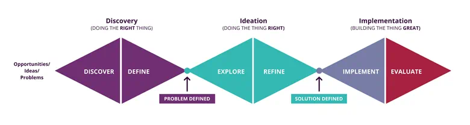

# The three phases
There are three key phases of the AEMO Human-Centred Design Process, and projects ideally go through all of these before they get in the hands of their customers or users.

## Discovery
Our primary customer research phase, used to gain a rich understanding of the problem to be solved or the opportunity to be explored and to validate our hypotheses, and to gain insight into our customer needs or pain-points in this space. This phase can deliver design artefacts such as guiding Design Principles, Customer Journey Maps, Personas or Behavioural archetypes that help to guide projects and assist in decision making later in the phases of the process.

## Ideation
With a clearly defined and customer/user generated problem to be solved, This phase is founded in creative thinking and an open mindset to explore the many possible ways to solve any given problem. We often generate many ideas and low-fidelity concepts to explore the desirability of any potential solutions. We use these low-fidelity concepts as thought provokers to rapidly test, fail and learn about what your customers/users want to iteratively create a solution and a roadmap of the key features to include in MVP (Minimum Viable Product) of the new solution.

## Implementation
Once a prototype has been validated with customers and a strong direction has been given, the implementation phase begins with more detailed refinement of the solution, and we continue to test and learn to as we develop new features in an agile approach to building out the MVP. This includes creation of user flows, wireframes, clickable prototypes and finally hi-fidelity designs for continual testing and refining of the detailed design of the solution to be shipped to customers.

 

## Iterative and cyclical
The HCD or Design Thinking process may at first appear linear, but it is actually iterative and cyclical. Ideas and solutions will evolve as they progress through the design process, and it can be often be necessary to circle back and undertake further discovery work to uncover more information or to explore other key features relating to the overarching idea or problem.

 

## Divergent and convergent thinking
The diamonds represent divergent and convergent thinking across the three phases of Discovery, Ideation and Implementation. While divergent and convergent thinking may seem opposed, they are in-fact complementary and a necessary mindset shift taken in order to broadly explore (divergent thinking) and then to analytically and systematically narrow down the gather information (convergent thinking) into tangible outputs (or experience maps) that can guide project teams into and through the next phase of the design process.