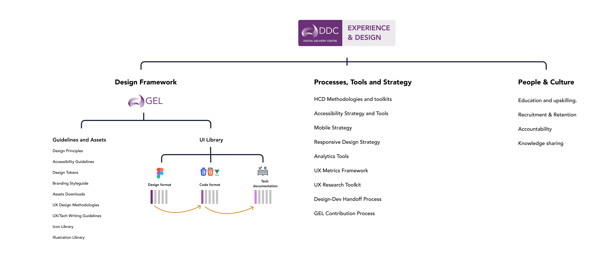

---
# Frontmatter, can be empty.
# Will use site title if empty.
title: Community
---

# Community of Practice

> Welcome to Experience and Design Practice. Here we are a community that is focused on improving how our customers and users interactive with AEMO’s digital platforms.  

## Our mission

To establish a customer-centric design capability in the organisation that utilises modern design techniques and extensive prototyping to improve our customer experience in our solutions.

## Key functions for Design Practice

### Design Processes  & Workflows 
The primary goal of this practice is to establish a highly efficient design process that generates high-quality design outputs. We create benefits for all people who are involved in the design process, not necessarily just the designers.

- Build a process that would optimize designers’ day-to-day workflow—maximize engagement and reduce duplicated efforts.
- Unify design language across platforms. Unified language helps designers achieve consistency across all platforms.​​​​​​​

### Design Tools
The practice also determines what tools design teams need to work efficiently. They standardize the tooling and systems used, as well as introduce new tools and make sure designers adopt them.

#### UX research: 
- HCD canvas, templates
- Analytics tool 
- Usability testings
- Workshop 

#### UI design 
- Design framework and language: GEL - AEMO's design system
- Figma (Design and prototype)

### People & Culture 
Invest in creating a design culture and promoting the culture within AEMO. The process of building a design culture includes the following areas:

- Education and upskilling. Design Practice figures out what skills are missing in a design team and how to gain them. They are also responsible for onboarding new team members.
- Recruitment & Retention. Design Practice protects designer resources from turnover by creating an environment in which people want to stay for longer periods of time.
- Accountability. They are responsible for holding the designer accountable.
- Knowledge sharing. They create a culture where team members share their knowledge generously with others.

## FAQ

    
How does my initiative engage with UX?

    We have a <a target="_blank" href="https://aemocdr.atlassian.net/wiki/spaces/DDC/pages/528580741/Initiative+Flow">Initiative Flow</a>

    
What is the differences between UX designer and UI designer?

    UI designers work on individual pages, buttons, and interactions; making sure they are polished and functional. UX designers take a more high-level view of a product or service, ensuring the collective user flow of a site, service, or app is fully realized and consistent. <a target="_blank" href="https://www.google.com/search?q=What+is+the+differences+between+UX+designer+and+UI+designer?&source=lmns&bih=1050&biw=1920&hl=en&sa=X&ved=2ahUKEwiu9KG5mvX7AhWY_jgGHQADDyMQ_AUoAHoECAEQAA">Learn more</a>

    
How can I get involved? 

    Contact the Design Practice Lead: Daniel Wang

